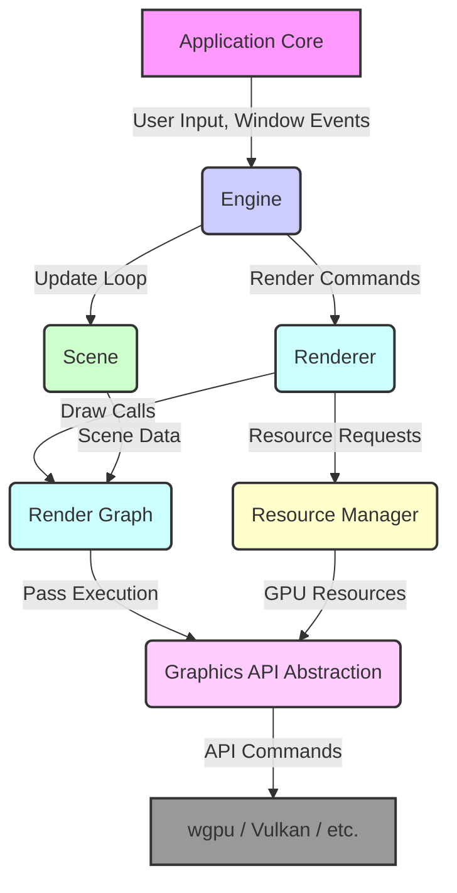

# Rust Real-Time Rendering Engine Architecture

**Version:** 0.1.0
**Date:** 2025-07-10
**Authors:** mpiispanen, @copilot

## 1. Overview

This document outlines the high-level architecture for a real-time rendering engine written in Rust. The primary goals are to create a modular, extensible, and performant framework suitable for prototyping various rendering algorithms.

The initial implementation will use `wgpu` for its portability and modern API, but the design will explicitly accommodate other graphics APIs like Vulkan, DirectX 12, or Metal in the future.

### Core Architectural Principles

-   **Modularity & Decoupling:** Components should have well-defined responsibilities and minimal dependencies on each other.
-   **Extensibility:** The architecture must be easy to extend with new rendering techniques, scene features, and backend APIs.
-   **Data-Oriented Design:** While using some object-oriented patterns for abstraction, we will prefer data-oriented approaches for performance-critical systems.
-   **Clear Ownership & Lifetimes:** Leverage Rust's ownership model to ensure resource safety and prevent common graphics programming pitfalls.

## 2. High-Level Architecture

The engine is composed of several distinct layers, each with a specific responsibility.

## 3. Component Deep Dive

### 3.1. Application Core (Event-Driven)

-   **Description:** Manages the main application loop, windowing, and OS-level events. It's the entry point of the application but knows nothing about rendering specifics.
-   **Approach:**
    -   Use `winit` for cross-platform window creation and event handling.
    -   The main loop will poll for events (`winit::event::Event`) and dispatch them to the `Engine`.
    -   Decouples the `Engine` from the event loop, allowing the `Engine` to be driven in a headless environment for testing or offline rendering.
-   **Pros:**
    -   Clean separation between platform specifics and engine logic.
    -   Leverages a mature, well-maintained library for windowing.
-   **Cons:**
    -   Event-based programming can lead to complex state management if not handled carefully (e.g., "callback hell").

### 3.2. Engine (Trait-Based Abstraction)

-   **Description:** The central coordinator. It holds the main state (Scene, Renderer) and implements the primary application logic.
-   **Approach:**
    -   Define a generic `Engine` trait.
    -   This allows for different engine implementations, e.g., a full `RealTimeEngine` or a minimal `TestEngine`.
    -   The trait would have methods like `new()`, `handle_event()`, `update()`, and `render()`.
-   **Pros:**
    -   Enforces a clean interface for the main application logic.
    -   Improves testability by allowing mock or specialized engine implementations.
-   **Cons:**
    -   A single, monolithic trait can become a bottleneck for features. We should consider breaking it into smaller, more focused traits if it grows too large.

### 3.3. Hierarchical Scene Graph

-   **Description:** Represents the contents of the 3D world, including objects, lights, and cameras.
-   **Approach:**
    -   A classic tree structure. A `Node` contains a `Transform` (position, rotation, scale), a list of children `Node`s, and an optional "content" `enum` (e.g., `Mesh`, `Light`, `Camera`).
    -   Global transforms are calculated by traversing up to the root.
-   **Pros:**
    -   Intuitive to understand and use.
    -   Simplifies relative positioning and animations.
    -   Naturally supports spatial culling algorithms (e.g., frustum culling).
-   **Cons:**
    -   **Performance:** Can be slow due to pointer chasing and non-contiguous memory access, leading to poor cache performance.
-   **Alternative/Future Consideration:**
    -   **Entity Component System (ECS):** An ECS architecture (like `bevy::ecs` or `specs`) would offer significantly better performance by storing components in contiguous arrays. We can start with a scene graph for simplicity and consider migrating performance-critical parts to an ECS later.

### 3.4. Render Graph (Dynamic & Node-Based)

-   **Description:** A system that defines, optimizes, and executes a series of rendering passes. It automatically manages dependencies and resource transitions between passes.
-   **Approach:**
    1.  **Graph Definition:** On each frame, the `Renderer` builds a graph where each node is a `RenderPass` (e.g., "ShadowPass", "GBufferPass", "LightingPass").
    2.  **Resource Declaration:** Each pass declares its resource inputs (e.g., "read from `SceneColor`") and outputs (e.g., "write to `PostProcessBuffer`").
    3.  **Graph Compilation:** Before execution, the `RenderGraph` compiler:
        -   Performs topological sort to determine execution order.
        -   Culls any passes whose outputs are not used.
        -   Manages resource lifetimes, creating transient resources (like G-Buffer attachments) only for the duration they are needed.
        -   Inserts resource transition barriers automatically.
    4.  **Graph Execution:** The `Renderer` iterates through the compiled list of passes and executes their associated commands.
-   **Pros:**
    -   **Modularity:** Render passes are self-contained and reusable.
    -   **Flexibility:** Easy to add, remove, or re-order passes without manual state management.
    -   **Efficiency:** Automatic culling and resource management reduce GPU memory pressure and unnecessary work.
    -   Excellent for prototyping new rendering pipelines.
-   **Cons:**
    -   Higher initial implementation complexity compared to a hard-coded renderer.
    -   Can introduce minor runtime overhead during the graph building/compilation phase.

### 3.5. Resource Management (Opaque Handles)

-   **Description:** Manages the lifetime and storage of all GPU resources (buffers, textures, shaders, samplers).
-   **Approach:**
    -   A central `ResourceManager` struct owns all `wgpu` resources.
    -   User code (e.g., a `Mesh` component) does not hold direct references (`Arc<wgpu::Buffer>`). Instead, it holds a lightweight, copyable, opaque `Handle<Buffer>`.
    -   The `ResourceManager` contains hashmaps to look up the actual `wgpu` resource from a given handle.
-   **Pros:**
    -   **Decoupling:** Separates user-facing logic from the graphics API implementation.
    -   **Lifetime Management:** Simplifies resource lifetimes; the manager handles creation and destruction.
    -   **Centralized Control:** Enables caching, deduplication, and hot-reloading of resources.
-   **Cons:**
    -   The manager can become a point of contention if not designed for concurrent access.
    -   Handle lookup introduces a small indirection overhead, but this is usually negligible.

## 4. Frame Lifecycle (Putting It All Together)

A single frame proceeds as follows:

1.  **Events:** `ApplicationCore` receives events from `winit` and sends them to the `Engine`.
2.  **Update:** `Engine` processes events and calls `update()` on the `Scene`. This is where animations, physics, and game logic would run.
3.  **Visibility & Culling:** The `Renderer` traverses the `Scene` to determine which objects are visible to the main camera.
4.  **Render Graph Setup:** The `Renderer` builds the `RenderGraph` for the current frame based on the visible objects and active rendering features.
5.  **Render Graph Execution:**
    -   The `RenderGraph` is compiled and executed.
    -   For each pass, the `Renderer` binds the required resources (using handles to fetch them from the `ResourceManager`) and issues draw calls.
6.  **Present:** The final rendered image is presented to the screen.

This architecture provides a solid foundation that balances flexibility, performance, and ease of use.